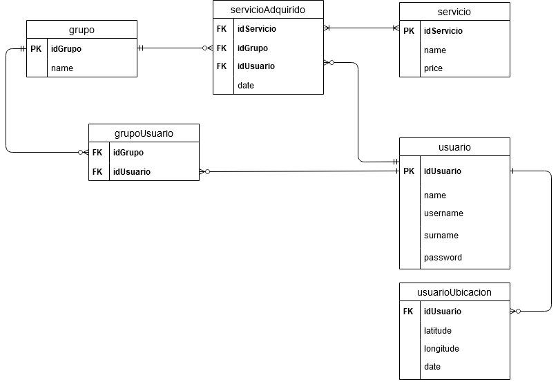

    
    <h1 align="center">Yii 2 - Test AlitáWare</h1>
     

La base de datos esta diseñada para permitir que varios usuarios puedan formar parte de distintos grupos como tambien no pertenecer a ninguno. La adquisicion de servicios no solo esta relacionada al usuario (para saber quien lo adquirio) si no tambien al grupo para que:

* Todos los usuarios de ese grupo puedan acceder al servicio
* Se apliquen descuentos por cantidad de usuarios en el grupo

Con respecto a la ubicacion se creo una tabla aparte. De esta manera es posible llevar un historial de los lugares en los que el usuario uso el sistema utilizando la fecha y las coordenadas.

REQUISITOS
------------

* Docker
* Docker-compose

INSTALACION
------------

### Instalar con Docker

Actualizar los paquetes del vendor

    docker-compose run --rm php composer update --prefer-dist
    
Instalar paquetes

    docker-compose run --rm php composer install    
    
Iniciar el contenedor

    docker-compose up -d

Poblar la base de datos

    ./init_db.sh
**Disclaimer**: Si tira el siguiente error "ERROR 2002 (HY000): Can't connect to local MySQL server through socket '/var/run/mysqld/mysqld.sock'" Esperar un momento y volver a intentar. La imagen de docker de MySQL 8 es un poco lenta. <a href="https://hub.docker.com/_/mysql">Ver aqui la parte de **No connections until MySQL init completes**</a>

Se puede acceder a la aplicacion desde la siguiente url

    http://127.0.0.1:8000

